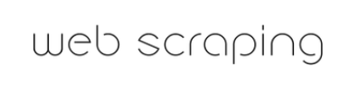
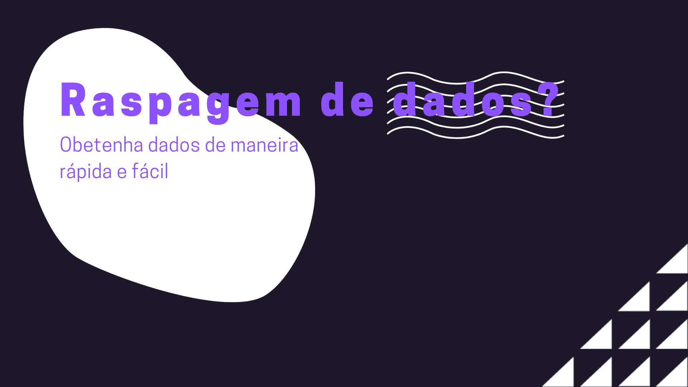
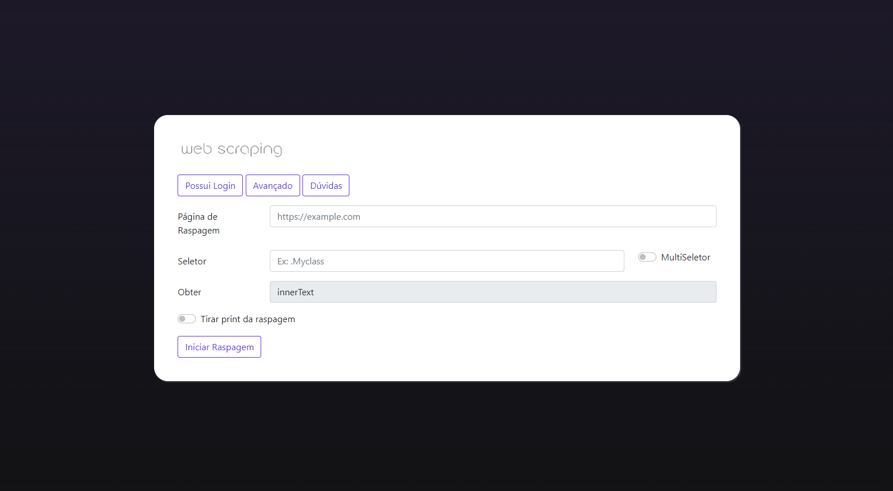

<p align="center">

</p>


## Descrição do Projeto
<p align="center">O projeto se trata de uma aplicação simples de raspagem de dados, onde o usuario possui a liberdade de escolher onde e qual determinado dado quer obter
</p>


<p align="center">


</p>
</br>

<h4 align="center"> 
	🚧  Projeto Web Scraping 🚀 Em construção...  🚧
</h4>
</br>
<p align="center">
 <a href="#Fatures">Fatures</a> •
 <a href="#pre-requsitos">Pré-requisitos</a> • 
 <a href="#tecnologias">Tecnologias</a> • 
 <a href="#contribuicao">Contribuição</a> • 
 <a href="#autor">Autor</a>
</p>


<hr>
<br>

## 📃 Features

O projeto ainda está em desenvolvimento e as próximas atualizações serão voltadas nas seguintes tarefas:

- [X] Ajustar Front=end
- [ ] Ajustar alguns campos do formulário
- [ ] Escrever as FAQs
- [ ] Fazer formulário avançado
- [ ] Vídeo explicativo


<h1 align="center">
  
</h1>
<h1 align="center">
  
</h1>

<br>

## 💻 Pré-requisitos

Antes de começar, você vai precisar ter instalado em sua máquina as seguintes ferramentas:
[Git](https://git-scm.com), [Node.js](https://nodejs.org/en/). 
Além disto é bom ter um editor para trabalhar com o código como [VSCode](https://code.visualstudio.com/)

## 🎲 Rodando o Back End (servidor)

```bash
# Clone este repositório
$ git clone https://github.com/lucasgf007/Web-Scraping

# Acesse a pasta do projeto no terminal/cmd
$ cd Web-Scraping

# Instale as dependências
$ npm install

# Execute a aplicação em modo de desenvolvimento
$ npm run start-dev

# O servidor inciará na porta:3000 - acesse <http://localhost:3000>
```
<br>

## 🛠️ Tecnologias

As seguintes ferramentas foram usadas na construção do projeto:

- [Node.js](https://nodejs.org/en/)
- [Bootstrap](https://getbootstrap.com/docs/5.0/getting-started/introduction/)
- [VSCode](https://code.visualstudio.com/)
- [Git](https://git-scm.com)
- Dependencies
```bash
# Dependências

# Express
$ npm install express

# Mustache
$ npm install mustache-express

# Nodemon
$ npm install nodemon

# Puppeteer
$ npm install puppeteer

# node_modules
$ npm install
```

## 📫 Contribuindo para *Web Scraping*

Para contribuir com o projeto, siga estas etapas:

1. Bifurque este repositório.
2. Crie um branch: `git checkout -b <nome_branch>`.
3. Faça suas alterações e confirme-as: `git commit -m '<mensagem_commit>'`
4. Envie para o branch original: `git push origin <nome_do_projeto> / <local>`
5. Crie a solicitação de pull.

Como alternativa, consulte a documentação do GitHub em [como criar uma solicitação pull](https://help.github.com/en/github/collaborating-with-issues-and-pull-requests/creating-a-pull-request).


## 👤 Autor
---

<a href="https://github.com/lucasgf007">
 
 <br />
 <sub><b>Lucas Gabriel</b></sub></a> <a href="https://github.com/lucasgf007" title="Dev">🚀</a>


Feito com ❤️ por Lucas Gabriel 👋🏽 Entre em contato!

[](mailto:gabriellucas016@gmail.com)